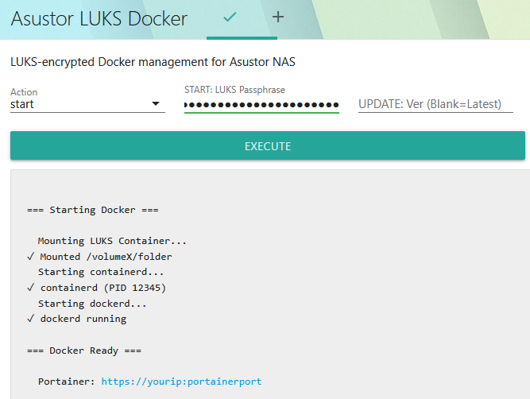

<p align="center">
  
</p>

# Docker on LUKS-Encrypted Storage for Asustor NAS

Run Docker on LUKS-encrypted storage with web UI management via script-server.

## Why?

Asustor's App Central Docker is unencrypted. Even if you store Docker data in an encrypted Shared Folder, your metadata, images, etc. are all exposed i.e. even if encrypted folders are unmounted, anyone with access can see and manipulate what you're running in Docker.

**For LUKS container management without Docker**, see [asustor-luks-manager](https://github.com/gooselabz/asustor-luks-manager).

## Key Challenges Overcome

- **Bash Works Better**: ADM defaults to BusyBox; bash is much better for this.
  - Solution: Install bash from entware.
- **ext4 Works Better**: The filesystem underlying LUKS drives what does/not work.
  - Solution: Store and mount your container on ext4 volumes, not btrfs.
- **pivot_root Fails on LUKS**: Containers fail with "pivot_root invalid argument" because Docker's data-root is on a loop-mounted LUKS image.
  - Solution: Set `DOCKER_RAMDISK=true` to use chroot instead of pivot_root (no RAM penalty).
- **Web GUI Works Better (For Most)**: For most scenarios eg after reboot, a simple web GUI is better than requiring SSH.
  - Solution (Optional): Install and configure script-server from App Central.

## Prerequisites

**Required:**

- Bash (e.g. install Entware from App Central, then `opkg update && opkg install bash`)

**Recommended (web UI):**

- script-server: Install from App Central

## Setup

### 1. Create LUKS Container

```bash
# Create sparse 10GB file (adjust size for your needs)
# Recommended: place in Shared Folder so ADM manages access, backups, etc.
truncate -s 10G /volumeX/yourpath/.docker_luks.img

# Format with LUKS (will prompt for passphrase)
sudo /usr/builtin/bin/cryptsetup luksFormat /volumeX/yourpath/.docker_luks.img

# Open and create ext4 filesystem
sudo /usr/builtin/bin/cryptsetup open /volumeX/yourpath/.docker_luks.img dockervault
sudo mkfs.ext4 -L docker_encrypted /dev/mapper/dockervault
sudo /usr/builtin/bin/cryptsetup close dockervault
```

### 2. Install Docker Binaries

```bash
# Create mount point
sudo mkdir -p /volumeX/docker

# Download Docker static binaries (adjust version as needed)
cd /tmp
curl -fSL https://download.docker.com/linux/static/stable/x86_64/docker-29.1.3.tgz -o docker.tgz
tar -xzf docker.tgz

# Mount LUKS container temporarily to install binaries
sudo /usr/builtin/bin/cryptsetup open /volumeX/yourpath/.docker_luks.img dockervault
sudo mount -t ext4 /dev/mapper/dockervault /volumeX/docker

# Copy binaries and create structure
sudo mkdir -p /volumeX/docker/{bin,appdata}
sudo cp docker/* /volumeX/docker/bin/
sudo chmod +x /volumeX/docker/bin/*

# Unmount
sudo umount /volumeX/docker
sudo /usr/builtin/bin/cryptsetup close dockervault
```

### 3. Configure Docker Daemon

Create `/etc/docker/daemon.json`:

```json
{
  "data-root": "/volumeX/docker/lib",
  "log-driver": "json-file",
  "log-opts": {
    "max-size": "10m",
    "max-file": "3"
  },
  "storage-driver": "overlay2",
  "iptables": false,
  "ip6tables": false,
  "ipv6": false,
  "bridge": "none",
  "userland-proxy": false
}
```

### 4. Install Script

1. Download `asustor-luks-docker.sh` from this repo to your preferred location (e.g., `/volumeX/yourpath/`)
2. Edit the configuration variables at the top of the script:
   - `DOCKER_DIR`: Path to Docker mount point (e.g., `/volumeX/docker`)
   - `LUKS_IMG`: Path to your `.img` file
   - `LUKS_DEV`: Device mapper name (must match what you used in cryptsetup open)
3. Make it executable: `chmod +x asustor-luks-docker.sh`
4. Create sudoers file (replace 'admin' with your selected username)

```bash
sudo tee /etc/sudoers.d/90-luks-docker << 'EOF'
admin ALL=(ALL) NOPASSWD: /usr/builtin/bin/cryptsetup open *
admin ALL=(ALL) NOPASSWD: /usr/builtin/bin/cryptsetup close *
admin ALL=(ALL) NOPASSWD: /bin/mount -t ext4 /dev/mapper/* *
admin ALL=(ALL) NOPASSWD: /bin/umount *
admin ALL=(ALL) NOPASSWD: /bin/umount -l *
admin ALL=(ALL) NOPASSWD: /bin/mkdir -p *
admin ALL=(ALL) NOPASSWD: /bin/pkill *
admin ALL=(ALL) NOPASSWD: /volumeX/docker/bin/dockerd *
admin ALL=(ALL) NOPASSWD: /volumeX/docker/bin/containerd *
admin ALL=(ALL) NOPASSWD: /usr/bin/cp *
admin ALL=(ALL) NOPASSWD: /bin/chmod *
EOF

sudo chmod 0440 /etc/sudoers.d/90-luks-docker
```

### 5. Install script-server Web UI

1. Download `asustor-luks-docker.json` from this repo to `/volumeX/.@plugins/AppCentral/scriptserver/script-server/conf/runners/`
2. Edit script_path in JSON to match your installation

## Usage

### Web UI (script-server)

1. Navigate to `http://YOUR_NAS_IP:SCRIPT-SERVER-PORT`
2. Click **Asustor LUKS Docker** item in left menu
3. Select action: `start`, `shutdown`, `status`, or `update`
4. For start: Enter passphrase in secure field (shown as dots)
5. For update: Optionally specify version (blank = latest)
6. Execute

### Command Line

```bash
# Start Docker (will prompt for passphrase)
/volumeX/yourpath/asustor-luks-docker.sh start

# Start with passphrase as argument (non-interactive)
/volumeX/yourpath/asustor-luks-docker.sh start "your-passphrase"

# Shutdown (stops containers gracefully, preserves restart policies)
/volumeX/yourpath/asustor-luks-docker.sh shutdown

# Status
/volumeX/yourpath/asustor-luks-docker.sh status

# Update Docker binaries
/volumeX/yourpath/asustor-luks-docker.sh update          # Auto-fetch latest
/volumeX/yourpath/asustor-luks-docker.sh update 29.1.3   # Specific version
```

# Security Notes

- **No keyfiles**: Passphrase required every mount—no keys stored on device
- Security = passphrase strength
- Sudoers allows passwordless operations—restrict to trusted usernames only
- Mounted data accessible per normal Linux file permissions
- Docker containers auto-start with `restart: unless-stopped` policy (recommended)

## Container Management Note

**Docker Restart Policies** (official Docker best practice):

```bash
# New containers with auto-restart
docker run -d --restart=unless-stopped --name portainer --network=host portainer/portainer-ce:latest

# Update existing containers
docker update --restart=unless-stopped <container_name>
```

With `restart: unless-stopped`, containers auto-start when dockerd starts. Shutdown command preserves these policies.

## Related Projects

- [asustor-luks-manager](https://github.com/gooselabz/asustor-luks-manager) - General LUKS container management (foundation for this project)

## License

MIT License - see [LICENSE](LICENSE) file
